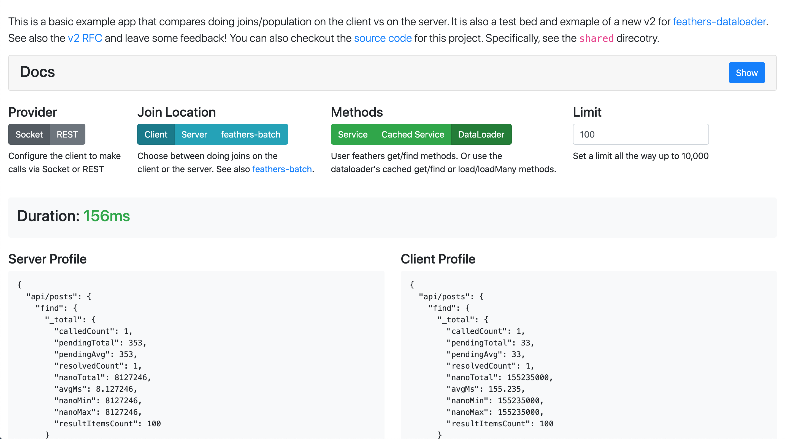

# test-feathers-client-joins



## About

This project is a basic setup to test joining/populating records from the client and its performance compared to the equivalent server side implementation. It consists of a database with 5,000 `posts` where each post joins a `category` and `user`. Each category then joins a `tag` and each user then joins a `bio`. The purpose of this thought experiment is to test if it is feasible to do multi-level joins from the client, allowing the client to request what it wants, when it wants it and also keeping the server thin and dumb.

The project uses `withResults` from `feathers-fletching` to accomplish the joins on both server and client. It also uses `feathers-batchloader` on both.
The combo of `withResults` and the `loaderFactory()` (a mixin for creating batchLoaders) is really solid and what most of my apps currently use on the server side. I wanted to see if I could move that all to client side, which was the genesis of this project. There is also a third hook called `withResultsGroupLoader` which combines batchLoaders and the concept of [feathers-batch](https://github.com/feathersjs-ecosystem/feathers-batch) which allows the client to run some code on the server.

Both the server and client also implement `feathers-profiler` to display the services called, their duration, etc.

I also made a video rambling through this thing and some of my thoughts
[Video](https://www.loom.com/share/ae6ed46cf0ea44ceb33b34c99b6cdbc5)

## Setup

The client side uses create-react-app. Note this is not a React specific implementaion or idea. I simply used React and Bootstrap because I know them well and this was just a quick weekend project. There is not a unified start/dev/build script. You will need to open two terminals and run the server in one terminal and run CRA in another terminal.

```js
// from the root dir
yarn install
yarn run dev

// from another terminal
cd client
yarn install
yarn start
```

## Takeaways

- When using sockets, joing from the client is very fast and the benefits it adds outweigh the very slight performance hit compared to doing it on the server, IMO.

- When using sockets, network connection is less of a factor. Even on "Slow 3G" network throttling, the joins are very fast. Its seems that network connection speed has no effect (once the socket is connected)

- When using REST, things are still pretty fast...I was impressed. It was faster than I expected. But the difference between it and the server implementation is substantial.

The `GroupLoader` idea has some legs. Not so much on a Socket implementation but certainly on REST. But, in order for it to be more performant, there has to be 6 or more of **concurrent** HTTP requests going on. With the default setup of joins in this example, its actually not any faster...because how `batchLoader` and `withResults` work the promises/http reqs are already optimized. Chrome generally allows up to 6 concurrent HTTP connections (See [Max Browser HTTP Connections](https://docs.pushtechnology.com/cloud/latest/manual/html/designguide/solution/support/connection_limitations.html)) and that means the current setup for the client `withResultsBatchLoader` only has two *concurrent* connections at any time.

```js
// This is how `withResultsBatchLoader` works

// Two **concurrent** HTTP reqs
await Promise.all([
    app.service('api/categories').find({ query: { _id: { $in: [100 ids] } } })
    app.service('api/users').find({ query: { _id: { $in: [100 ids] } } })
]);

// Then later, two more **concurrent** HTTP reqs
await Promise.all([
    app.service('api/bios').find({ query: { _id: { $in: [100 ids] } } })
    app.service('api/tags').find({ query: { _id: { $in: [100 ids] } } })
]);
```

```js
// This is how `withResultsGroupLoader` works

// One HTTP req
await Promise.all([
    app.service('api/batch').create([ category/batch instructions ])
]);

// Then later, one more HTTP req
await Promise.all([
    app.service('api/batch').create([ tag/bio instructions ])
]);
```

So there is only two going on at anytime with `withResultsBatchLoader`...and Chrome (and most other browsers) allow up to 6. So the `withResultsGroupLoader` is not any faster because we aren't maxing out the concurrent requests.

Checkout `client/src/feathers/posts` and you will notice that there are more joins commented out. Start uncommenting those and you will see that `withResultsGroupLoader` becomes more performant than `withResultsBatchLoader`

